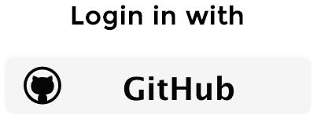

# Express login demo with auth0 and passportjs

  

This demo app shows a login with github.
For the full list of supported logins, check [auth0](https://auth0.com)

## Configure
1. Create an account at [auth0](https://auth0.com)
1. Open `app/config.js` and add your auth0 audience and secret keys
1. Register an auth0 application in your [github](https://github.com) acount

## Running
1. Run `npm start`
1. Open <http://localhost:3000/>

## Contributing
1. Fork it!
2. Create your feature branch: `git checkout -b my-new-feature`
3. Commit your changes: `git commit -m 'Add some feature'`
4. Push to the branch: `git push origin my-new-feature`
5. Submit a pull request :D

## License
MIT